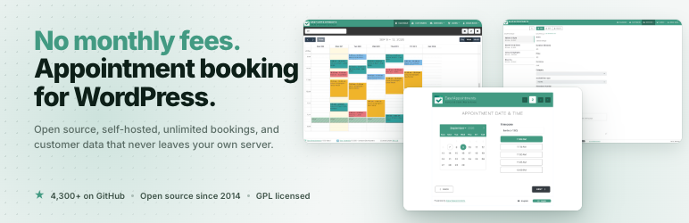

<h1 align="center">
    <br>
    <a href="https://easyappointments.org">
        
    </a>
    <br>
    Easy!Appointments - WordPress Plugin
    <br>
</h1>

<br>

<h4 align="center">
    Add a full appointment booking system to WordPress. No monthly fees, no per-booking charges, your data on your server.
</h4>

<p align="center">
  
  
</p>

<p align="center">
  <a href="#about">About</a> •
  <a href="#gutenberg--elementor">Gutenberg & Elementor</a> •
  <a href="#setup">Setup</a> •
  <a href="#installation">Installation</a> •
  <a href="#license">License</a>
</p>



## About

**Let customers book appointments on your website, 24/7, without a monthly subscription or a fee on every booking.**

[Easy!Appointments](https://easyappointments.org) is made of two pieces, and it is worth knowing that up front:

1. **Easy!Appointments**, the booking engine. Your calendar, services, staff, working hours and customers live here. Free, open source, installed on your own hosting (PHP + MySQL, same as WordPress).
2. **This plugin**, the bridge. It puts that booking form onto a page of your WordPress site, on your domain, inside your theme, so customers never get bounced to a different-looking site to book.

So yes, you need the engine installed before this plugin does anything. Keeping it separate is exactly what makes it free and unlimited: no company in the middle metering your bookings, no third party holding your customer list.

**See it working first:** [demo.easyappointments.org](https://demo.easyappointments.org). Real booking form, real admin calendar, no signup.

Developed in the open since 2014. 4,300+ GitHub stars, used by organisations including NEOM, Doctors Without Borders and Dolce & Gabbana.

*Minimum Requirements: WordPress v5.0 & PHP v5.6*

## Gutenberg & Elementor

### Native Gutenberg Block

Love the WordPress block editor? The **Easy!Appointments block** is a first-class citizen of the block inserter. Search for "Easy!Appointments", drop it in, and configure width, height, styling, and provider/service pre-selection right from the block settings panel. No shortcodes, no code.

### Elementor Widget

Building with Elementor? Find the **Easy!Appointments widget** in the Elementor panel, drag it onto your canvas, and set everything up visually with full property controls. It fits your workflow perfectly.

### Shortcode (works everywhere else)

For classic editors, other page builders, or anywhere shortcodes are supported:

```
[easyappointments width="100%" height="500px" style="border: 5px solid #1A865F; box-shadow: #454545 1px 1px 5px;"]
```

Pre-select a provider and/or service (IDs found in your Easy!Appointments backend):

```
[easyappointments provider="2" service="1"]
```

### Connecting Easy!Appointments with WordPress

Install and activate the plugin and navigate to `Easy!Appts` in the WordPress admin menu. Paste your Easy!Appointments installation URL and connect. Once connected, embed the booking form using the Gutenberg block, the Elementor widget, or the shortcode.

### Translations

This plugin uses the **i18n** localization system of WordPress and the translations are po & mo files located in the 
`languages` directory. Contributions are more than welcome so feel free to make pull requests with your translations or 
send them directly to [info@alextselegidis.com](mailto:info@alextselegidis.com).

## Get in touch

Easy!Appointments is built and maintained by Alex Tselegidis. If you are weighing it up, stuck on an
installation, wondering whether it fits an unusual booking workflow, or you need custom work or a
commercial arrangement around it, write to me directly at
[info@alextselegidis.com](mailto:info@alextselegidis.com) or via
[alextselegidis.com](https://alextselegidis.com).

Feature ideas and bug reports are just as welcome. Tell me what you were trying to do and where it
got in the way.

## Setup

To clone and run this application, you'll need [Git](https://git-scm.com), [Node.js](https://nodejs.org/en/download/) 
(which comes with [npm](http://npmjs.com)) and [Composer](https://getcomposer.org) installed on your computer. From your 
command line:

```bash
# Clone this repository
$ git clone https://github.com/alextselegidis/easyappointments-wordpress.git

# Go into the repository
$ cd easyappointments-wordpress

# Install dependencies
$ composer install
```

## Installation

After building the plugin you will get a zip file that can be used with in the WordPress plugin installation page.

## License 

Code Licensed Under [GPL v3.0](https://www.gnu.org/licenses/gpl-3.0.en.html) | Content Under [CC BY 3.0](https://creativecommons.org/licenses/by/3.0/)

---

Website [alextselegidis.com](https://alextselegidis.com) &nbsp;&middot;&nbsp;
GitHub [alextselegidis](https://github.com/alextselegidis) &nbsp;&middot;&nbsp;
Twitter [@alextselegidis](https://twitter.com/AlexTselegidis)

###### More Projects On Github
###### ⇾ [Easy!Appointments &middot; Open Source Appointment Scheduler](https://github.com/alextselegidis/easyappointments)
###### ⇾ [Plainpad &middot; Self Hosted Note Taking App](https://github.com/alextselegidis/plainpad)
###### ⇾ [Integravy &middot; Service Orchestration At Your Fingertips](https://github.com/alextselegidis/integravy)
